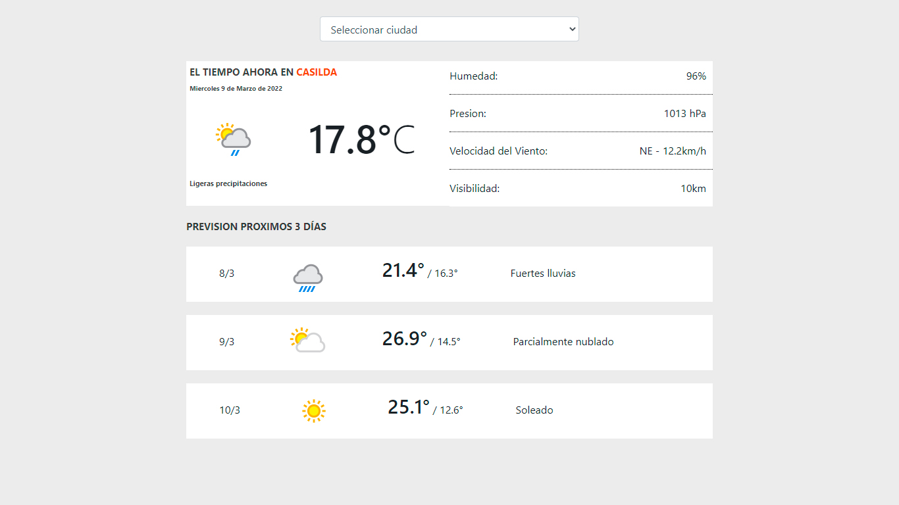

# Aplicacion del clima

El siguiente desafío plantea el desarrollo de una aplicación de consulta de clima en la que
el usuario pueda visualizar el pronóstico actual y el de los próximos 5 días de la ciudad en
la que se encuentra, y a su vez un selector que permita cambiar entre 5 ciudades
preseleccionadas

## weatherapi

WeatherAPI.com brinda acceso a datos meteorológicos y geográficos a través de una API tranquila JSON/XML. Permite a los desarrolladores crear aplicaciones de escritorio, web y móviles usando estos datos muy fácilmente.[Interactive API Explorer](https://www.weatherapi.com/).

### `npm start`

1- git clone https://github.com/gabrielcasafu/openweather.git
2- cd weatherapi
3- npm install
4- npm start

### `Visualizacion`

